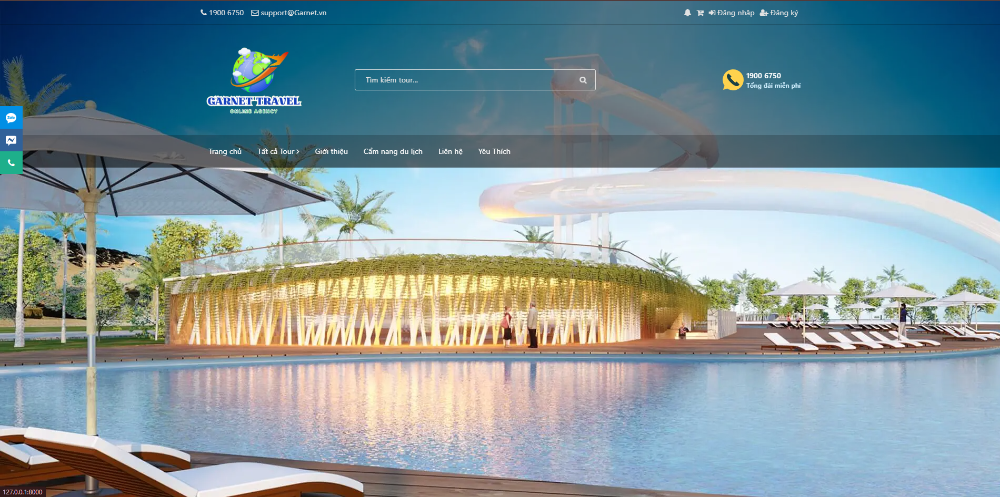

# Booking Garnet Travel

Garnet Travel là một ứng dụng web được phát triển bằng PHP/Laravel, hỗ trợ người dùng đặt tour du lịch trực tuyến và theo dõi booking, quản lý thông tin khách hàng, tour, người dùng, danh mục, địa điểm, các nghiệp vụ liên quan và các giao dịch một cách dễ dàng và tiện lợi.

## 🎯 Trọng tâm:
 • PHP/Laravel
 • RESTful API 
 • MySQL 
 • Laravel Sanctum 
 • Authentication & Authorization • Postman

## 📌 Mục lục

- Tổng quan
- Tính năng chính
- Công nghệ sử dụng
- Kiến trúc Backend
- Luồng nghiệp vụ
- RESTful API
- Xác thực và phân quyền
- Các nhóm API
- Validation và xử lý lỗi
- Cơ sở dữ liệu
- Email và Queue
- Kiểm thử API
- Cấu trúc thư mục
- Cài đặt
- Git Workflow
- Kinh nghiệm áp dụng
- Hướng phát triển

## 🌟 Tổng quan

- BookTour Garnet gồm:

**👤 Khách hàng**
- Đăng ký/đăng nhập
- Xem, tìm kiếm và lọc tour
- Xem chi tiết tour, lịch trình và giá
- Đặt tour trực tuyến
- Theo dõi lịch sử booking
- Quản lý tài khoản
- Đánh giá và bình luận
- Sử dụng mã giảm giá
- Nhận email xác nhận booking

**🛠️ Quản trị viên**
CRUD tour
- Quản lý danh mục và địa điểm
- Quản lý khách hàng
- Quản lý booking
- Quản lý hướng dẫn viên
- Quản lý coupon
- Quản lý review/comment
- Quản lý quyền truy cập
- Theo dõi thông tin booking
- Quản lý đánh giá
- Quản lý phân quyền

**🧑‍💼 Hướng dẫn viên**
- Xem tour được phân công
- Cập nhật thông tin/trạng thái tour được giao

## 🎯 Tính năng chính

**🏝️ Quản lý Tour**
- CRUD tour
- Quản lý danh mục, địa điểm và lịch trình
- Quản lý giá tour
- Quản lý số lượng khách
- Theo dõi số lượng khách đã đăng ký
- Upload hình ảnh
- Tìm kiếm, lọc và phân trang

**🧾 Đặt Tour**
- Luồng nghiệp vụ:
- Khách hàng → Chọn tour → Chọn số lượng khách → Validate → Kiểm tra khả dụng → Tạo booking → Xử lý payment → Cập nhật trạng thái → Gửi email
- Backend xử lý:
- Số lượng người lớn/trẻ em
- Kiểm tra khả dụng của tour
- Validation dữ liệu
- Theo dõi số khách đã đăng ký
- Lịch sử booking
- Hủy/cập nhật trạng thái booking
- Liên kết booking với payment

## 🚀 Công nghệ sử dụng

- **Backend**: PHP 8.2+ ,Laravel 10.x, RESTful API, Eloquent ORM, Form Request Validation, API Resource, Middleware, Queue/Job
- **Frontend**: Blade Template + HTML/CSS/JS + jQuery + Bootstrap
- **Cơ sở dữ liệu**: MySQL
- **Server**: Laragon (hoặc môi trường PHP tương tự)
- **Khác**: Composer, NPM, Mailtrap (hoặc SMTP), Git/Github, Laragon, Postman, SMTP/Mail service

## 📦 Cài đặt

1. **Clone dự án từ repository**:
   ```bash
   git clone <repository_url>
   cd booking-garnet-travel
2. **Cài đặt các dependency**:
   ```bash
    composer install
    npm install
    npm run dev
3. **Tạo file .env và cấu hình**:
   ```bash
   cp .env.example .en
4. **Tạo database và migrate**:
    ```bash
   php artisan migrate --seed
5. **Tạo khóa ứng dụng**:
    ```bash
    php artisan key:generate
6. **Khởi động server**:
    ```bash
    php artisan serve
7. **Mail hàng chờ**:
    ```bash
    php artisan queue:work
8. **Truy cập ứng dụng tại**:
    [http://localhost:8000](http://localhost:8000)
9. **Cài capcha**:
    composer require anhskohbo/no-captcha
## 🛠️ Lệnh Artisan hữu ích

- Tạo dữ liệu mẫu:
  ```bash
  php artisan db:seed
  ```
- Xóa và làm mới database:
  ```bash
  php artisan migrate:fresh --seed
  ```
- Kiểm tra route:
  ```bash
  php artisan route:list
  ```

## 📂 Cấu trúc thư mục chính

- **app/**: Chứa logic của ứng dụng.
- **resources/views/**: Giao diện frontend với Blade Template.
- **routes/web.php**: Định tuyến cho ứng dụng.
- **database/**: Migration và dữ liệu mẫu.

## 📋 Ghi chú phát triển

1. **Yêu cầu hệ thống**:
   - PHP >= 8.1
   - Composer >= 2.5
   - Node.js >= 18.x
   - MySQL >= 8.x

2. **Mailtrap**:
   - Sử dụng Mailtrap hoặc SMTP khác để cấu hình gửi email xác nhận.

3. **Môi trường phát triển**:
   - Khuyến nghị sử dụng Laragon hoặc Docker để tối ưu hóa quá trình phát triển.


## 📧 Liên hệ

- **Email**: support@garnettravel.com
- **Website**: [Garnet Travel](https://garnettravel.com)

---